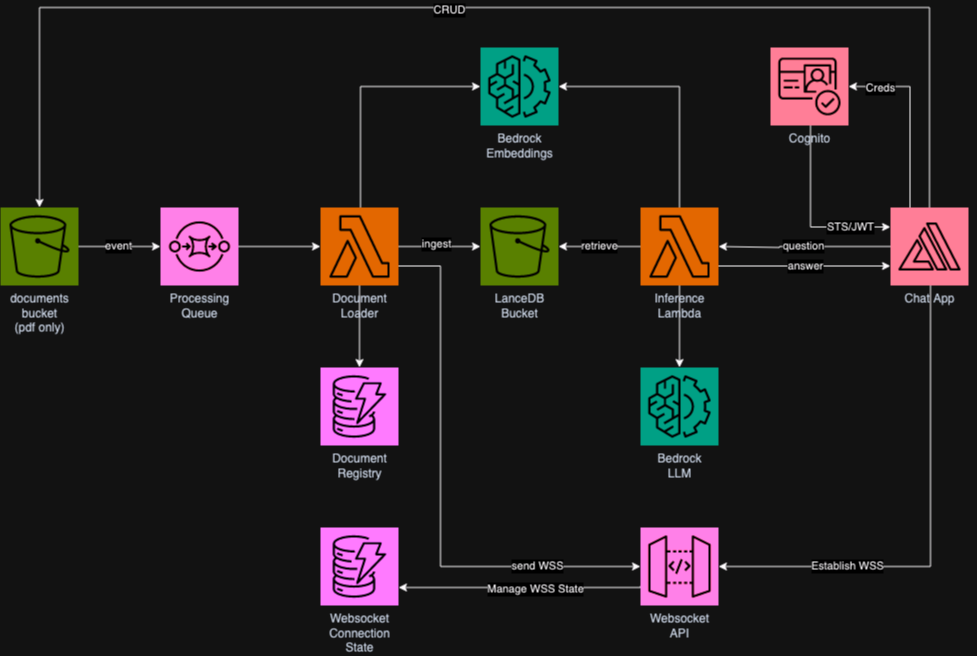
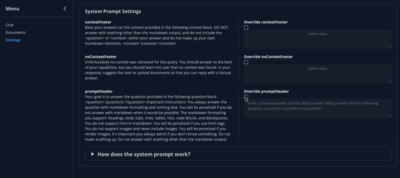

# Full Stack Serverless Retrieval Augmented Generation Application on AWS
## Architecture



To learn more about this architecture, please refer to [this article](https://bit.ly/community-serverless-rag).

## Demo


## Features

### Chat Playground
Interact with LLMs and inspect retrieved documents.

### Chat History Management
Manage your chat history, select which messages are to be forwarded or add messages to test and debug your prompts.

### Serverless Knowledge Base
This sample makes use of LanceDB and S3 as vector database. With this configuration, you'll only pay for the storage you use and you won't have to manage additional infrastructure.

### Dynamic Prompt Management

Users can override the default system prompt by specifying new prompts in the settings.


#### Changing the Default Prompt Dynamically

To change the default prompt dynamically for all users, follow these steps:

1. Open the [`prompt-templates.yml`](https://github.com/aws-samples/Serverless-Retrieval-Augmented-Generation-RAG-on-AWS/blob/main/lib/prompt-templates.yml) file.
2. Update the prompt templates as per your requirements.
3. Save the changes.
4. Run the [`update-default-prompt-templates.ts`](https://github.com/aws-samples/Serverless-Retrieval-Augmented-Generation-RAG-on-AWS/blob/main/update-default-prompt-templates.ts) script using the following command:

```sh
npx ts-node update-default-prompt-templates.ts
```

**WARNING:** Depending on your setup, you may need to change the region or profile in the script or pass it through the environment variables.


## Prerequisites

- NodeJS >= v18.18.2 and NVM for node version management
- Docker
- AWS Cloud Development Kit (CDK) cli >= 2.142.1

## Config

### Supported Regions
This sample only supports regions where Bedrock is available and at least one Embedding model is present. As of July 2024, this sample supports
```
us-east-1
us-east-2
us-west-2
eu-central-1
eu-west-2
eu-west-3
ap-south-1
ap-southeast-2
ap-northeast-1   
ca-central-1
sa-east-1
```
### Embedding Configuration
You can switch the default embedding model by changing the config file at `lib/llm-config.json`.  
Once the sample is deployed you should NOT switch the embedding model. Changing it may lead to errors or unexpected results in your semantic search.

#### Sample Configuration
```json
{
    "us-west-2":{
        "embedding":{
            "model":"amazon.titan-embed-text-v1",
            "size":1536
        }
    },
...
}
```

## Installation

```sh
nvm use # makes use of node 18
npm install
```

## Deploy

* For greater access to LLMs (at the time of writing), deploy the stack in the `us-west-2` region.
* Deploying for the first time should take around 20 minutes (depending on your upload speed)

```sh
cdk deploy
```

After a successful deployment, you should have a list of outputs in your console, similar to the following

```bash
Outputs:
ServerlessRagOnAwsStack.FrontendConfigS3Path = s3://ServerlessRagOnAwsStack-frontendbucketxxxxx-xxxx/appconfig.json
ServerlessRagOnAwsStack.WebDistributionName = https://dxxxxxxxxxx.cloudfront.net
ServerlessRagOnAwsStack.allowUnauthenticatedIdentities = true
ServerlessRagOnAwsStack.authRegion = us-west-2
ServerlessRagOnAwsStack.identityPoolId = us-west-2:xxxxxxxxxxxxxx
ServerlessRagOnAwsStack.passwordPolicyMinLength = 8
ServerlessRagOnAwsStack.passwordPolicyRequirements = ["REQUIRES_NUMBERS","REQUIRES_LOWERCASE","REQUIRES_UPPERCASE","REQUIRES_SYMBOLS"]
ServerlessRagOnAwsStack.signupAttributes = ["email"]
ServerlessRagOnAwsStack.userPoolId = us-west-2_xxxxxxxxxx
ServerlessRagOnAwsStack.usernameAttributes = ["email"]
ServerlessRagOnAwsStack.verificationMechanisms = ["email"]
ServerlessRagOnAwsStack.webClientId = xxxxxxxxxxxxx
Stack ARN:
arn:aws:cloudformation:us-west-2:ACCOUNT_NUMBER:stack/ServerlessRagOnAwsStack/XXXXXXXXXXXXXXXXXXXX
```

## Test
You'll find the URL of your application as the stack output named `ServerlessRagOnAwsStack.WebDistributionName`.  
It looks something like `https://dxxxxxxxxxxx.cloudfront.net`

## Running the front-end locally

You can run this vite react app locally following these steps.

### 1. Deploy infrastructure to AWS

Follow [instructions above](#installation) to deploy the cdk app.

### 2. Obtain environment configuration

Run the script 
```bash
./fetch-frontend-config.sh ServerlessRagOnAwsStack
```

This will copy the file `appconfig.json` into `./resources/ui/public/` from the bucket where the front-end is hosted.  
This is all public information that the front-end application uses to interact with the backend.  
You can modify it to point it to an alternative backend stack for development purposes.

Alternatively, run the following command and replace the placeholders with values taken from the stack's output

```bash
aws s3 cp ${ServerlessRagOnAwsStack.FrontendConfigS3Path} ./resources/ui/public/
```

#### Example Configuration File
```json
{
    "inferenceURL": "https://xxxxxxxxxxxxx.lambda-url.us-west-2.on.aws/",
    "websocketURL": "wss://xxxxxxxxxx.execute-api.us-west-2.amazonaws.com/Prod",
    "websocketStateTable": "ServerlessRagOnAwsStack-websocketStateTable-xxxxxxxx",
    "region": "us-west-2",
    "bucketName": "ServerlessRagOnAwsStack-documentsbucket-xxxxxxxxx",
    "auth": {
        "user_pool_id": "us-west-2_XXXXXXXXXX",
        "aws_region": "us-west-2",
        "user_pool_client_id": "XXXXXXXXXX",
        "identity_pool_id": "us-west-2:XXXXX-XXXX-XXXXXX",
        "standard_required_attributes": [
            "email"
        ],
        "username_attributes": [
            "email"
        ],
        "user_verification_types": [
            "email"
        ],
        "password_policy": {
            "min_length": 8,
            "require_numbers": true,
            "require_lowercase": true,
            "require_uppercase": true,
            "require_symbols": true
        },
        "unauthenticated_identities_enabled": true
    },
    "version": "1",
    "storage": {
        "bucket_name": "ServerlessRagOnAwsStack-documentsbucket-XXXXXXXXXXX",
        "aws_region": "us-west-2"
    }
}
```

### 3. Run local dev server

```sh
cd resources/ui
npm run dev
```

### Changing the Default Prompt Dynamically

To change the default prompt dynamically, follow these steps:

1. Open the [`prompt-templates.yml`](https://github.com/aws-samples/Serverless-Retrieval-Augmented-Generation-RAG-on-AWS/blob/main/lib/prompt-templates.yml) file.
2. Update the prompt templates as per your requirements.
3. Save the changes.
4. Run the [`update-default-prompt-templates.ts`](https://github.com/aws-samples/Serverless-Retrieval-Augmented-Generation-RAG-on-AWS/blob/main/update-default-prompt-templates.ts) script using the following command:

```sh
npx ts-node update-default-prompt-templates.ts
```

**WARNING:** Depending on your setup, you may need to change the region or profile in the script or pass it through the environment variables.

## Authors

**Giuseppe Battista** is a Senior Solutions Architect at Amazon Web Services. He leads soultions architecture for Early Stage Startups in UK and Ireland. He hosts the Twitch Show "Let's Build a Startup" on [twitch.tv/aws](https://bit.ly/basup-twitch) and he's head of Unicorn's Den accelerator.   
Follow Giuseppe on [LinkedIn](https://bit.ly/43l7eEb)  

**Kevin Shaffer-Morrison** is a Senior Solutions Architect at Amazon Web Services. He's helped hundreds of startups get off the ground quickly and up into the cloud. Kevin focuses on helping the earliest stage of founders with code samples and Twitch live streams.  
Follow Kevin on [LinkedIn](https://www.linkedin.com/in/kshaffermorrison)

**Anthony Bernabeu** is a Senior IoT Prototyping Architect at Amazon Web Services. He builds, jointly with customers, the most exciting and innovative IoT and Generative Ai prototypes on AWS.  
Follow Anthony on [LinkedIn](https://bit.ly/4ehuyrg)

## Contributors

**Kirtan Dudhatra** is a software engineer at AWS, working on the Step Functions service. He has a strong background in distributed systems and cloud computing, and are passionate about solving complex problems and delivering high-quality software solutions.    
Follow Kirtan on [LinkedIn](www.linkedin.com/in/kirtandudhatra)
